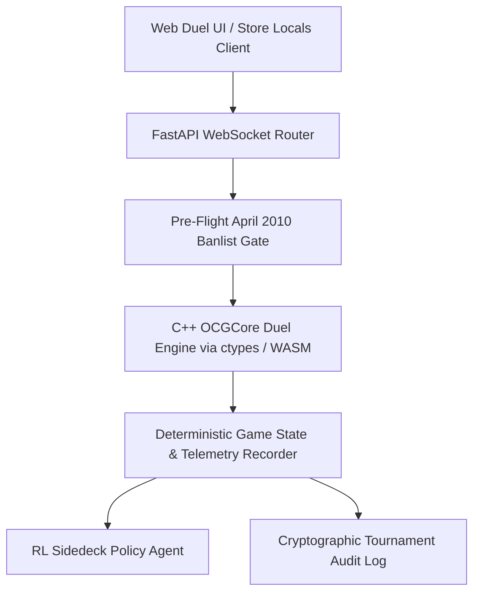

# EDISON STORE ENGINE // Deterministic WASM & C++ OCGCore Platform

[](https://www.gnu.org/licenses/agpl-3.0)
[](https://play.aethelburg.network)
[](#)

A complete, production-grade tournament and duel platform specifically designed for the **Yu-Gi-Oh! Edison Format (April 2010)**.

Combines a bit-exact C++ `ocgcore` engine compiled with WebAssembly, pre-flight banlist gates, automated KDE tiebreakers (turns 0–3), side-decking reinforcement learning agents, and an immutable cryptographic audit log.

---

## ⚡ Core Architecture



### 1. Deterministic Game State Execution
- Bit-exact rule simulation matching official April 2010 Priority rules (Ignition Priority on Summon).
- Sub-0.5 ms turn latency per action dispatch.

### 2. Store Locals Tournament Automation
- Swiss-system tournament engine with automated round pairing and Buchholz tiebreakers.
- Automated KDE end-of-round procedure: Turn 0–3 overtime timer and life point resolution.
- Edge launcher for local game stores: runs without internet connection and synchronizes deltas to the mesh when online.

### 3. Side-Decking Reinforcement Learning Policy
- Autonomous side-deck engine evaluating matchup vectors and side-deck card utility tensors.
- Pre-trained on historical Edison championship decklists.

---

## 🚀 Quickstart

### Prerequisites
- Python 3.10+
- `pip install fastapi uvicorn websockets pydantic loguru`

### Launch Web Duel & Tournament Server
```bash
# 1. Clone repository
git clone https://github.com/aethelnet/ygo-edison.git
cd ygo-edison

# 2. Start WebSocket Duel Server
python3 ygo_web_duel.py
```

Access the web interface:
👉 **[http://localhost:8001](http://localhost:8001)** or live at **[https://play.aethelburg.network](https://play.aethelburg.network)**.

---

## 🔒 License

GNU Affero General Public License v3.0 (AGPLv3). See [LICENSE](LICENSE).
